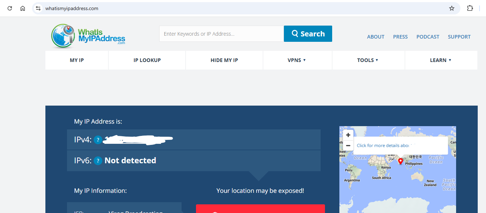
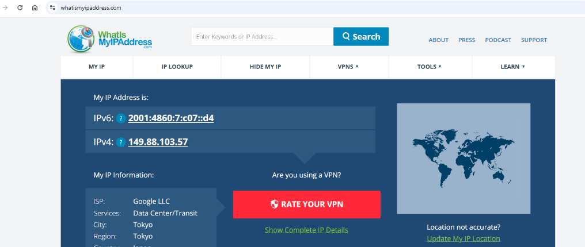
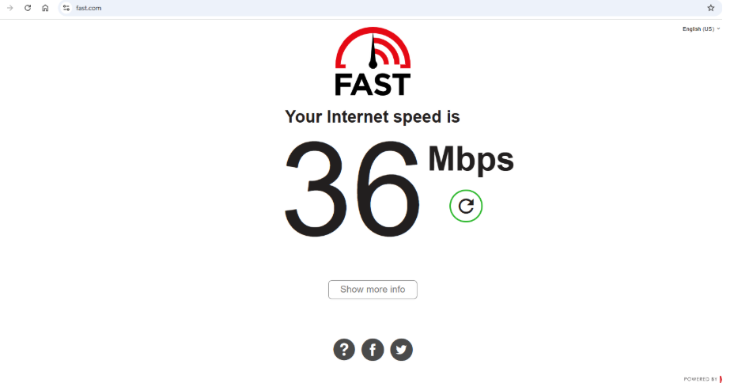

# VPN Exploration & Hands-On Guide

Welcome to the **VPN Exploration** repository!  
This guide walks you through understanding, configuring, and testing VPNs to improve online privacy and secure communication. It is designed for beginners and aspiring professionals.

---

## Objective

The purpose of this hands-on exploration is to:  

- Set up and configure a free VPN client.  
- Verify IP address masking and encrypted traffic.  
- Analyze VPN impact on browsing speed and network performance.  
- Understand VPN encryption protocols and privacy features.  
- Summarize the benefits and limitations of VPN usage.  

---

## Tools Used

- **VPN Client**: ProtonVPN (Free Tier)  
- **IP Verification Tool**: [whatismyipaddress.com](https://whatismyipaddress.com)  
- **Speed Test Tool**: [fast.com](https://fast.com)  

---

## Step-by-Step Hands-On

### 1. VPN Service Selection & Installation
- Chose **ProtonVPN Free Tier** for its strong privacy, no-logs policy, and security features.  
- Created a free account and installed the ProtonVPN desktop client.  

### 2. VPN Connection Setup
- Logged in and connected to the **nearest available server**.  
- Verified connection status from ProtonVPN client.  
- 

### 3. IP Address Verification
- Checked the public IP before and after connecting using **whatismyipaddress.com**.  
- Confirmed successful IP masking.  
-   
- 

### 4. Encrypted Traffic Confirmation
- Browsed websites like Google and YouTube while connected.  
- Traffic was routed through an encrypted tunnel.  

### 5. Performance & Speed Test
- Conducted speed tests using **fast.com** with VPN enabled and disabled.  
- Observed slight reduction in speed while VPN was active (expected).  
-   

### 6. Disconnection & Comparison
- Disconnected VPN and compared browsing speed, IP, and geolocation.  

---

## Findings

- **IP Masking**: VPN successfully replaced the real IP with a server IP.  
- **Traffic Encryption**: Ensured privacy and security over public networks.  
- **Performance Impact**: Minor speed reduction with VPN, still acceptable for browsing and streaming.  

---

## VPN Features Researched

- **Encryption Protocols**: OpenVPN, WireGuard.  
- **Privacy Features**:  
  - No-Logs Policy  
  - Kill Switch  
  - DNS Leak Protection  

---

## Benefits of VPN

- Hides IP and location.  
- Encrypts online traffic for secure communication.  
- Prevents tracking by ISPs and third parties.  
- Bypasses geographic restrictions.  

---

## Limitations of VPN

- Free versions may have limited servers and slower speed.  
- Cannot guarantee complete anonymity.  
- Some websites block VPN traffic.  

---

## Deliverables

- VPN connection status screenshot.  
- IP verification screenshots (before and after).  
- Speed test screenshots (VPN on/off).  

---

## Conclusion

This hands-on exploration demonstrates how VPNs enhance privacy and secure communication. VPNs successfully mask IP addresses, encrypt traffic, and protect user data. Minor performance trade-offs are expected, and VPNs should be used alongside other privacy best practices.  

---
